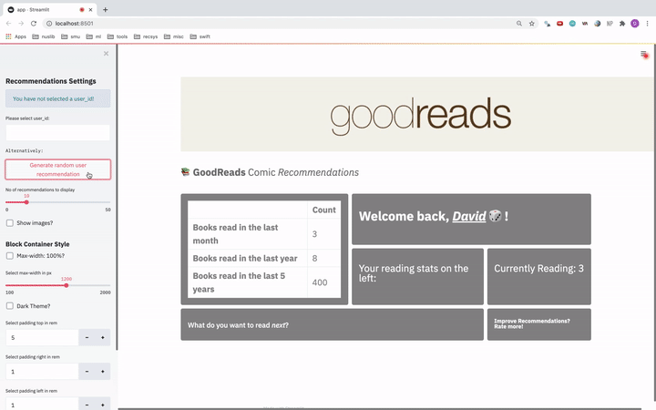

# cs608-recsys
Repo for CS608 - Recommender System (Project 2)



## Setup
1. Clone repo

```
git clone https://github.com/davidcjw/cs608-recsys.git
```

2. Change directory

```
cd cs608-recsys
```

3. Create new environment
4. Install requirements

```
pip install -r requirements.txt
```

### Deploy Application
1. Run streamlit app locally

```
streamlit run app.py
```

2. Deploy streamlit app on Heroku
```
heroku login
heroku create <project name>
git push heroku master
```